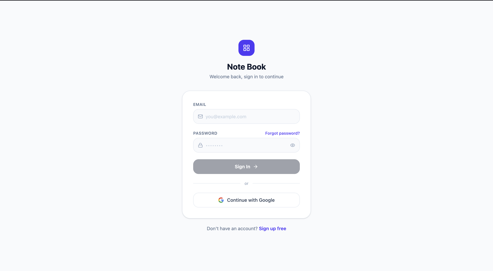
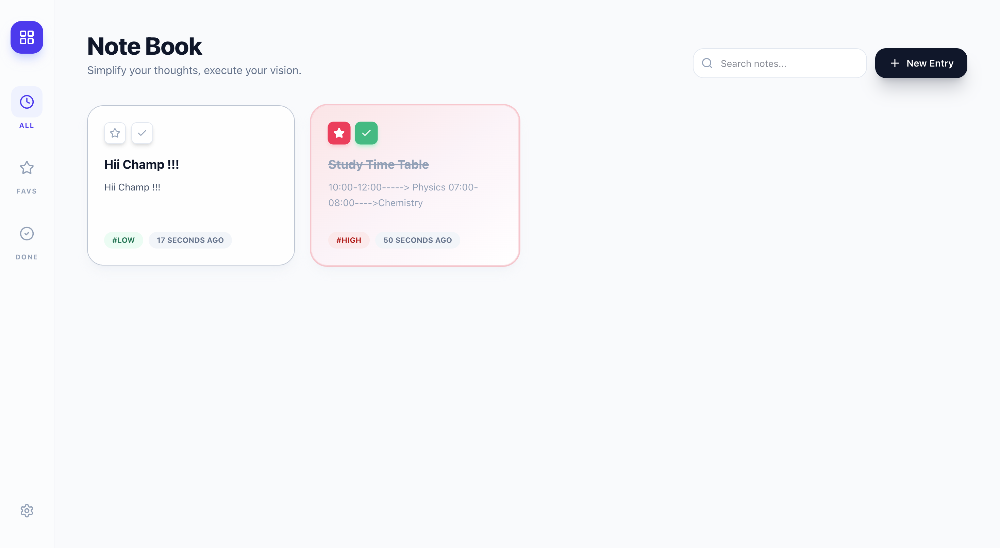
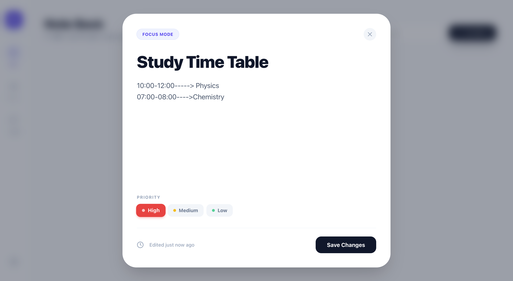

<div align="center">

<!-- LOGO -->


<br/>

# 📓 Notebook

### *Smart Note Management — Beautifully Simple*

<br/>

[](https://react.dev/)
[](https://supabase.com/)
[](https://tailwindcss.com/)
[](https://vitejs.dev/)
[](LICENSE)

<br/>

> A high-performance, minimalist note-taking app with secure auth, real-time sync, and a beautiful UI — built for people who think in notes.

<br/>

[🚀 Live Demo](https://notebookpi.netlify.app/) · [🐛 Report Bug](../../issues) · [✨ Request Feature](../../issues)

---

</div>

<br/>

## 📸 Screenshots

<div align="center">

### 🔐 Login & Signup


<br/><br/>

### 🗂️ Dashboard — Your Notes at a Glance


<br/><br/>

### ✏️ Create & Edit Notes


</div>

<br/>

---

## ✨ Features

| Feature | Description |
|---|---|
| 🔐 **Secure Auth** | User-specific login & signup via Supabase Auth |
| 📝 **Create Notes** | Instantly create notes with a smooth, responsive UI |
| 👁️ **View Notes** | Organized dashboard displaying all your saved notes |
| ✏️ **Edit Notes** | Update any note with real-time database syncing |
| 🗑️ **Delete Notes** | Remove notes or individual entries with ease |
| 🔒 **User Isolation** | Every user only sees and manages their own data |
| ☁️ **Persistent Storage** | Notes are safely stored in Supabase (PostgreSQL) |
| 💨 **Smooth UX** | Polished transitions and minimal interface for deep focus |

<br/>

---

## 🛠️ Tech Stack

<div align="center">

| Layer | Technology |
|---|---|
| ⚛️ **Frontend** | React.js (Vite) |
| 🎨 **Styling** | Tailwind CSS |
| 🔧 **Icons** | Lucide Icons |
| 🗄️ **Database** | Supabase (PostgreSQL) |
| 🔐 **Auth** | Supabase Auth |
| 🌐 **Hosting** | Vercel / Netlify |

</div>

<br/>

---

## 📁 Project Structure

```
notebook/
├── public/
│   ├── logo.png
│   └── screenshots/
│       ├── login.png
│       ├── dashboard.png
│       └── editor.png
├── src/
│   ├── components/
│   │   ├── NoteCard.jsx
│   │   ├── NoteEditor.jsx
│   │   └── Navbar.jsx
│   ├── pages/
│   │   ├── Login.jsx
│   │   ├── Signup.jsx
│   │   └── Dashboard.jsx
│   ├── lib/
│   │   └── supabaseClient.js
│   ├── App.jsx
│   └── main.jsx
├── .env
├── package.json
└── README.md
```

<br/>

---

## ⚙️ Installation & Setup

### Prerequisites

- Node.js `>= 18.x`
- A [Supabase](https://supabase.com) account and project

<br/>

### 1️⃣ Clone the Repository

```bash
git clone https://github.com/piushmaji/notebook.git
cd notebook
```

### 2️⃣ Install Dependencies

```bash
npm install
```

### 3️⃣ Configure Environment Variables

Create a `.env` file in the root directory:

```env
VITE_SUPABASE_URL=your_supabase_project_url
VITE_SUPABASE_ANON_KEY=your_supabase_anon_key
```

> 💡 Find these in your Supabase project under **Settings → API**.

### 4️⃣ Launch the App

```bash
npm run dev
```

Open [http://localhost:5173](http://localhost:5173) in your browser. 🎉

<br/>

---

## 🗃️ Database Structure (Supabase)

The app uses a `notes` table in Supabase with the following schema:

```sql
CREATE TABLE notes (
  id          UUID DEFAULT gen_random_uuid() PRIMARY KEY,
  user_id     UUID REFERENCES auth.users(id) ON DELETE CASCADE,
  title       TEXT NOT NULL,
  content     TEXT,
  created_at  TIMESTAMP WITH TIME ZONE DEFAULT NOW()
);

-- Enable Row Level Security
ALTER TABLE notes ENABLE ROW LEVEL SECURITY;

-- Policy: Users can only access their own notes
CREATE POLICY "Users can manage their own notes"
  ON notes FOR ALL
  USING (auth.uid() = user_id);
```

<br/>

---

## 🔄 How It Works

```
User signs up / logs in
        ↓
Supabase Auth issues JWT token
        ↓
Dashboard fetches notes WHERE user_id = auth.uid()
        ↓
User creates / edits / deletes notes
        ↓
Changes sync instantly to Supabase PostgreSQL
```

<br/>

---

## 🚀 Deployment

### Deploy to Vercel

```bash
npm install -g vercel
vercel --prod
```

> Add your `VITE_SUPABASE_URL` and `VITE_SUPABASE_ANON_KEY` as environment variables in your Vercel project settings.

<br/>

---

## 🤝 Contributing

Contributions, issues and feature requests are welcome!

1. Fork the project
2. Create your feature branch: `git checkout -b feature/AmazingFeature`
3. Commit your changes: `git commit -m 'Add AmazingFeature'`
4. Push to the branch: `git push origin feature/AmazingFeature`
5. Open a Pull Request

<br/>

---

## 📄 License

Distributed under the MIT License. See [`LICENSE`](LICENSE) for more information.

<br/>

---

<div align="center">

Built with ❤️ by **[Piush Maji](https://github.com/piushmaji)**

<br/>

⭐ **Star this repo** if you found it helpful!

[](https://github.com/piushmaji/notebook/stargazers)
[](https://github.com/piushmaji/notebook/network/members)

</div>